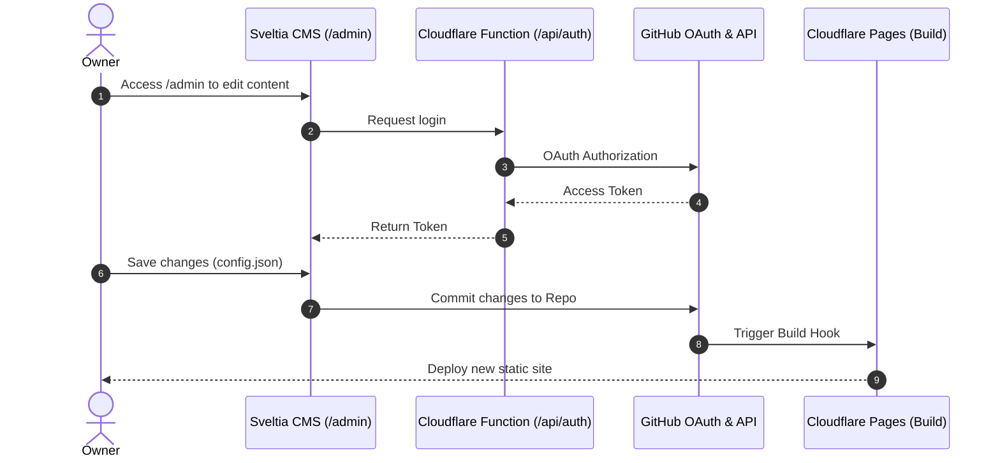

# 🧠 Project Context & Agent Session Summary

> [!IMPORTANT]
> **Instructions for AI Coding Assistants:**
> 1. Read this entire document before proposing or executing code changes to understand the project architecture, domain models, conventions, and previous session history.
> 2. Whenever you finish a significant milestone or end a session, update the **Session History & Progress Log** section at the bottom of this file so subsequent sessions maintain continuity.

---

## 📌 1. Project Blueprint & High-Level Overview

- **Project Name:** `Gateway Link Hub & Personal Portal`
- **Repository:** `fatahilah-mr/gateway`
- **Current Version / Milestone:** `v1.0.0 (Production)`
- **Core Value Proposition:** An independent, ultra-fast, responsive, and elegant personal link portal and portfolio hub. It replaces platforms like Linktree, offering zero-code content management via Sveltia CMS, bilingual support, dynamic theming, and GSAP-powered 3D animations, hosted for free on Cloudflare Pages.
- **Primary Users / Consumers:** Recruiters, clients, peers, and the project owner for managing personal and professional links seamlessly.

---

## 🛠️ 2. Tech Stack & Environment

| Component | Technology | Version | Notes / Conventions |
| :--- | :--- | :--- | :--- |
| **Language / Runtime** | JavaScript / Node.js | `v20.x+` | React SPA, built with Vite |
| **Framework** | React 18 | `18.x` | Functional components, Hooks, Context API |
| **Styling & Animation** | CSS3 / GSAP 3 | `3.12.x` | Glassmorphism, 3D interactive tilt cards |
| **Icons** | MUI Material Icons | `9.x` | Replaced Lucide for performance and variety |
| **CMS** | Sveltia CMS | `latest` | Headless Git-based CMS (Decap config compatible) |
| **CI / CD & Hosting** | Cloudflare Pages | `N/A` | Edge deployment, Serverless Functions for OAuth |

---

## 🏗️ 3. Architecture & Data Flow

### Architecture Pattern
This project is a **Static Site SPA with Git-Based CMS**:
- **Presentation Layer (`src/components/`, `src/App.jsx`)**: React components rendering the UI.
- **State & Context (`src/context/`, `src/hooks/`)**: Managing bilingual text (`LanguageProvider`) and dynamic theming (`ThemeProvider`).
- **Content Storage (`public/content/config.json`)**: JSON file defining the site's content, updated by Sveltia CMS.
- **Auth & CMS Integration (`functions/api/auth/`)**: Cloudflare Pages Serverless Function handling GitHub OAuth login for Sveltia CMS.

### Sequence Flow


---

## 📂 4. Directory Map & Module Responsibilities

```text
/
├── functions/            # Cloudflare Pages serverless functions (OAuth API)
│   └── api/auth/         # GitHub OAuth handler for Sveltia CMS
├── public/               # Static assets, CMS config, and deployed content
│   ├── _headers          # HTTP Headers (Canonical enforcement)
│   ├── _redirects        # 301 Redirect rules for old domains & canonical enforcement
│   ├── admin/            # Sveltia CMS index.html & config.yml
│   └── content/          # config.json containing link & text content
├── src/                  # React source code
│   ├── components/       # LinkCard, Loader, SEOHead
│   ├── context/          # LanguageProvider, ThemeProvider
│   ├── data/             # iconMap.js for mapping CMS icon names to MUI components
│   ├── hooks/            # useConfig hook for fetching config.json
│   ├── App.css           # Global styles, Glassmorphism, animations
│   └── main.jsx          # React app entry point
└── package.json          # Project dependencies (Vite, React, GSAP, MUI)
```

---

## ⚠️ 5. AI Agent Guardrails & Strict Rules

1. **🔒 Security & Secret Scrubbing:** Never output, print, or commit real API keys or private environment variables into chat logs or git commits.
2. **✨ Performance Focus:** Keep bundle size minimal. We recently migrated from `lucide-react` to `@mui/icons-material` and centralized mapping to cut bundle size from 1,700+ modules to 315 modules. Do NOT introduce heavy dependencies unnecessarily.
3. **🌐 SEO Compliance:** Ensure canonical links and 301 redirects are maintained. `SEOHead.jsx`, `public/_headers`, and `public/_redirects` currently handle duplicate URL issues. Do not break these.
4. **✏️ Zero-Code Editing Constraints:** All textual and link data must remain in `public/content/config.json` so the owner can edit via Sveltia CMS. Do NOT hardcode links or copy in React components if they belong in the CMS.
5. **🧩 CMS Compatibility:** `public/admin/config.yml` controls the fields. Ensure any JSON schema changes match the YAML widget definitions.

---

## 📝 6. Session History & Chat Summary Log

| Session Date | Author / Agent | Milestone / Task | Key Files Touched | Next Step / Handover |
| :--- | :--- | :--- | :--- | :--- |
| `2026-07-23` | Antigravity AI | CMS Migration & Performance | `public/admin/index.html`, `src/data/iconMap.js`, `package.json` | Migrated to Sveltia CMS, Replaced Lucide with MUI Icons |
| `2026-07-24` | Antigravity AI | Domain Change & Rebranding | `index.html`, `README.md`, `config.yml`, `robots.txt`, `sitemap.xml` | Updated domain from links.fatahmr.my.id to fatah.web.id |
| `2026-07-28` | Antigravity AI | SEO & Canonical Enforcement | `SEOHead.jsx`, `public/_headers`, `public/_redirects` | Fixed duplicate page issues in Google Search Console |
| `2026-08-01` | Antigravity AI | Project Documentation | `gateway.id.md`, `gateway.en.md` | Created GUIDE-PROJECT-AI.md compliant project gallery files |
| `2026-08-27` | Antigravity AI | Context Setup | `CONTEXT.md`, `.gitignore` | Created CONTEXT.md template and ignored template folder |

### Session Entry: `2026-08-27` (Context Setup)
- **Objective:** Create a `CONTEXT.md` file based on the template folder to serve as the master knowledge base for AI assistants and project context.
- **Completed Work:**
  - Crafted `CONTEXT.md` outlining the tech stack, architecture, and previous AI sessions.
  - Added `template/` to `.gitignore`.
- **Next Planned Action:** Project is currently stable and in production.

---

## 📋 7. Backlog & Next Actions

- [ ] Ongoing maintenance and minor UI tweaks as requested by the owner.
