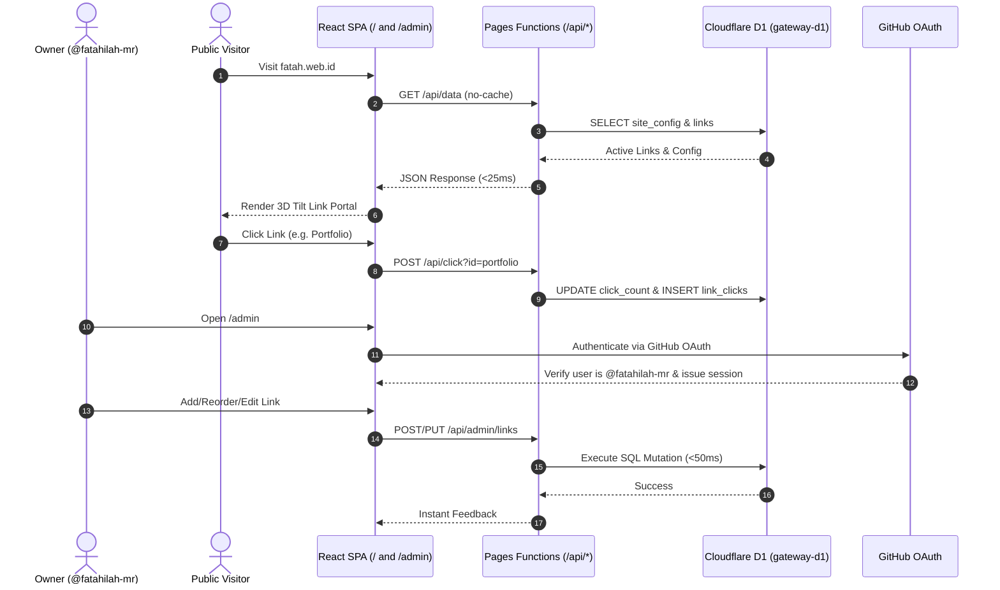

# 🧠 Project Context & Agent Session Summary

> [!IMPORTANT]
> **Instructions for AI Coding Assistants:**
> 1. Read this entire document before proposing or executing code changes to understand the project architecture, domain models, conventions, and previous session history.
> 2. Whenever you finish a significant milestone or end a session, update the **Session History & Progress Log** section at the bottom of this file so subsequent sessions maintain continuity.
> 3. **Mandatory Rule:** At the conclusion of EVERY session or after completing changes, you MUST update this `CONTEXT.md` file with the latest state, files touched, and next actions.

---

## 📌 1. Project Blueprint & High-Level Overview

- **Project Name:** `Gateway Link Hub & Personal Portal`
- **Repository:** `fatahilah-mr/gateway`
- **Active Feature Branch:** `feat/overhaul-d1-revamp`
- **Live Preview URL:** [https://feat-overhaul-d1-revamp.web-gateway-2pd.pages.dev](https://feat-overhaul-d1-revamp.web-gateway-2pd.pages.dev)
- **Live Admin Portal:** [https://feat-overhaul-d1-revamp.web-gateway-2pd.pages.dev/admin](https://feat-overhaul-d1-revamp.web-gateway-2pd.pages.dev/admin)
- **Production Domain:** [https://fatah.web.id](https://fatah.web.id)
- **Current Version / Milestone:** `v2.0.0 (D1 Edge Dynamic Portal)`
- **Core Value Proposition:** An independent, ultra-fast, responsive, and elegant personal link portal and portfolio hub. Powered by Cloudflare Pages + Cloudflare D1 (Edge SQLite) with an integrated Native Admin Control Panel, GitHub OAuth authentication, real-time link click analytics, zero-cache latency, bilingual support (ID/EN), dynamic theming, and GSAP-powered 3D tilt animations.
- **Primary Users / Consumers:** Recruiters, clients, peers, and the project owner for managing personal and professional links seamlessly.

---

## 🛠️ 2. Tech Stack & Environment

| Component | Technology | Version | Notes / Conventions |
| :--- | :--- | :--- | :--- |
| **Language / Runtime** | JavaScript / Node.js | `v20.x+` | React SPA, built with Vite 5 |
| **Framework** | React 18 | `18.3.x` | Functional components, Hooks, Context API, Client Routing |
| **Database** | Cloudflare D1 | `SQLite Edge` | `gateway-d1` (UUID: `f71f7c73-a7b9-4166-bfd1-d4bcc84caef8`) |
| **Serverless API** | Cloudflare Pages Functions | `v3 runtime` | `/functions/api/` (Edge endpoints with D1 binding `DB`) |
| **Auth** | GitHub OAuth + Signed HMAC | Native | Only `@fatahilah-mr` allowed admin session |
| **Styling & Animation** | CSS3 Neo-Brutalism / GSAP 3 | `3.12.x` | Neo-Brutalism with small dot matrix grid, hard offset shadows, mechanical tactile interactions |
| **Icons** | MUI Material Icons | `9.x` | Centralized mapping via `iconMap.js` with accent badge backgrounds |
| **Admin Panel** | Native Integrated SPA | Custom `/admin` | Real-time CRUD, reordering, and click analytics |
| **Notifications** | ntfy & Telegram | CLI scripts | `notify-ntfy` & `notify-tele` |
| **CI / CD & Hosting** | Cloudflare Pages | `N/A` | Automated build & preview deployments on git push |

---

## 🏗️ 3. Architecture & Data Flow

### Architecture Pattern
This project is an **Edge-Driven Dynamic SPA on Cloudflare Pages + D1**:
- **Presentation Layer (`src/components/`, `src/App.jsx`)**: React components rendering both public link hub and `/admin` control panel.
- **Data Hook (`src/hooks/useConfig.js`)**: Fetches `/api/data` with `cache: 'no-store'` for instant updates with fallback to `config.json`.
- **Serverless API Layer (`functions/api/`)**:
  - `GET /api/data`: Returns site config & active links directly from D1 with strict anti-cache headers.
  - `POST /api/click`: Increments click counter and logs event in `link_clicks` table using `waitUntil`.
  - `GET/POST /api/auth/*`: Handles GitHub OAuth login, callback, `/me`, and `/logout`.
  - `CRUD /api/admin/*`: Protected management endpoints for links, profile config, and analytics.
- **Database (`gateway-d1`)**: Cloudflare D1 SQLite database containing `site_config`, `links`, and `link_clicks`.

### Sequence Flow


---

## 📂 4. Directory Map & Module Responsibilities

```text
/
├── .agents/skills/                # Installed project skills (33 skills for architecture, react, ui/ux)
├── functions/                     # Cloudflare Pages Serverless Functions
│   └── api/
│       ├── _auth.js               # Shared HMAC token, cookie parser & auth utilities
│       ├── data.js                # Public API returning D1 config & links with no-cache headers
│       ├── click.js               # Public analytics endpoint for link click tracking
│       ├── auth/
│       │   └── [[path]].js        # GitHub OAuth flow (login, callback, /me, /logout)
│       └── admin/
│           ├── links.js           # Admin CRUD for links
│           ├── links/
│           │   └── reorder.js     # Batch reorder links endpoint
│           ├── config.js          # Admin GET/PUT for site_config
│           └── analytics.js       # Admin click metrics & activity log
├── migrations/                    # Cloudflare D1 SQL Migrations
│   ├── 0001_initial_schema.sql    # D1 tables (site_config, links, link_clicks)
│   └── 0002_seed_data.sql         # Seed data from original config.json
├── public/                        # Static assets & routing rules
│   ├── _headers                   # HTTP headers (Canonical, anti-cache, noindex admin)
│   ├── _redirects                 # 301 Redirects & SPA fallback (/* -> /index.html 200)
│   └── content/                   # config.json (retained as offline fallback)
├── src/                           # React 18 Source Code
│   ├── components/
│   │   ├── admin/                 # Native Admin Panel
│   │   │   ├── AdminPortal.jsx    # Auth state wrapper
│   │   │   ├── AdminLogin.jsx     # GitHub OAuth login screen
│   │   │   ├── AdminDashboard.jsx # Full management dashboard (links, profile, analytics)
│   │   │   └── admin.css          # Glassmorphism admin styling
│   │   ├── LinkCard.jsx           # 3D interactive GSAP tilt card + click tracking
│   │   ├── Loader.jsx             # Entrance animation loader
│   │   └── SEOHead.jsx            # Dynamic canonical & SEO tags
│   ├── context/
│   │   ├── LanguageProvider.jsx   # ID / EN bilingual provider
│   │   └── ThemeProvider.jsx      # Dark / Light theme provider
│   ├── data/
│   │   └── iconMap.js             # Direct MUI icon mapping
│   ├── hooks/
│   │   └── useConfig.js           # Dynamic D1 fetch with no-store & fallback
│   ├── App.css                    # Main styling, responsive design & mesh backgrounds
│   ├── App.jsx                    # Root app with client-side routing (/ and /admin)
│   └── main.jsx                   # Entry point
├── wrangler.toml                  # Cloudflare Pages & D1 binding configuration
├── eslint.config.js               # ESLint configuration
└── package.json                   # Project dependencies (Vite, React, GSAP, MUI)
```

---

## ⚠️ 5. AI Agent Guardrails & Strict Rules

1. **🔒 Security & Secret Scrubbing:** Never output, print, or commit real API keys or private environment variables into chat logs or git commits. Session authentication verifies that only GitHub username `fatahilah-mr` can mutate data.
2. **✨ Performance & Bundle Size:** Keep bundle size minimal. Use direct imports for `@mui/icons-material` via `src/data/iconMap.js`. Avoid large unnecessary external packages.
3. **⚡ Zero-Cache Latency:** Any public endpoint reading dynamic content (`/api/data`) MUST enforce `Cache-Control: no-store, no-cache, must-revalidate, max-age=0` to ensure changes made in the admin panel appear instantly to visitors without CDN delay.
4. **🌐 SEO Compliance:** Ensure canonical links and 301 redirects are maintained in `SEOHead.jsx`, `public/_headers`, and `public/_redirects`. Admin route `/admin` must remain `noindex`.
5. **🛡️ Resilient Fallback:** `src/hooks/useConfig.js` must always support graceful fallback to `public/content/config.json` if the D1 API is unavailable during local development.
6. **📝 Mandatory CONTEXT.md Maintenance:** Every AI assistant MUST update `CONTEXT.md` (including the Session History & Progress Log) at the conclusion of every session or upon making code changes, so that future sessions always maintain unbroken continuity.

---

## 📝 6. Session History & Chat Summary Log

| Session Date | Author / Agent | Milestone / Task | Key Files Touched | Next Step / Handover |
| :--- | :--- | :--- | :--- | :--- |
| `2026-07-23` | Antigravity AI | CMS Migration & Performance | `public/admin/index.html`, `src/data/iconMap.js`, `package.json` | Migrated to Sveltia CMS, Replaced Lucide with MUI Icons |
| `2026-07-24` | Antigravity AI | Domain Change & Rebranding | `index.html`, `README.md`, `config.yml`, `robots.txt`, `sitemap.xml` | Updated domain from links.fatahmr.my.id to fatah.web.id |
| `2026-07-28` | Antigravity AI | SEO & Canonical Enforcement | `SEOHead.jsx`, `public/_headers`, `public/_redirects` | Fixed duplicate page issues in Google Search Console |
| `2026-08-01` | Antigravity AI | Project Documentation | `gateway.id.md`, `gateway.en.md` | Created GUIDE-PROJECT-AI.md compliant project gallery files |
| `2026-08-27` | Antigravity AI | Context Setup | `CONTEXT.md`, `.gitignore` | Created CONTEXT.md template and ignored template folder |
| `2026-09-09 (Part 1)` | Antigravity AI | Total Overhaul: Cloudflare D1 & Native Admin | `functions/api/*`, `src/components/admin/*`, `src/hooks/useConfig.js`, `src/App.jsx`, `wrangler.toml` | Overhauled to Cloudflare Pages + D1 with Native Admin, GitHub OAuth, click tracking, 0-cache latency. |
| `2026-09-09 (Part 2)` | Antigravity AI | Frontend Neo-Brutalism & Dot Grid Redesign | `src/App.css`, `src/index.css`, `src/App.jsx`, `src/components/LinkCard.jsx`, `src/components/Loader.jsx`, `src/components/admin/admin.css`, `index.html` | Restyled public portal & admin to high-contrast Neo-Brutalism with 16px small dot grid, tactile physics, accent badges, and confirmed D1 migration. |

### Session Entry: `2026-09-09 (Part 1)` (Total Overhaul: Cloudflare D1 & Native Admin)
- **Objective:** Complete architecture revamp replacing static Git-based CMS with Cloudflare D1 relational database, Cloudflare Pages Functions serverless API, Native Integrated Admin Dashboard (`/admin`), GitHub OAuth security, real-time click tracking, and zero-cache latency.
- **Completed Work:**
  - Branch `feat/overhaul-d1-revamp` created and linked.
  - Initialized Cloudflare D1 database `gateway-d1` and attached `DB` binding to `web-gateway` on Cloudflare Pages.
  - Created D1 migration schemas and seed data in `migrations/0001_initial_schema.sql` and `0002_seed_data.sql`.
  - Built Cloudflare Pages Functions API: `data.js`, `click.js`, `auth/[[path]].js`, `admin/links.js`, `admin/links/reorder.js`, `admin/config.js`, `admin/analytics.js`, `_auth.js`.
  - Built Native Admin Dashboard in `src/components/admin/`: `AdminPortal.jsx`, `AdminLogin.jsx`, `AdminDashboard.jsx`, `admin.css`.
  - Removed legacy Sveltia files (`public/admin/`) to enable pure SPA routing to the native admin interface.
  - Updated `useConfig.js` to dynamically load from `/api/data` with `cache: 'no-store'` and fallback to `config.json`.
  - Updated `LinkCard.jsx` with non-blocking click tracking to `/api/click`.
  - Updated `public/_redirects` and `public/_headers` for SPA `/admin` route fallback and SEO `noindex`.
  - Added `wrangler.toml` with D1 database binding and verified zero-error `npm run build` and `npm run lint`.
  - Installed 33 skills in `.agents/skills` and pushed cleanly.
  - Verified live preview deployment at `https://feat-overhaul-d1-revamp.web-gateway-2pd.pages.dev`.
  - Delivered push notifications via `notify-tele` and `ntfy` (`ntfy.sh/agent-vps-529b6e0b7cab`).

### Session Entry: `2026-09-09 (Part 2)` (Frontend Neo-Brutalism Overhaul & Data Migration Verification)
- **Objective:**
  1. Clarify whether legacy markdown data was migrated to Cloudflare D1 SQLite.
  2. Redesign the entire frontend to **Neo-Brutalism** with a **small dot matrix background ("background dot kecil")**.
  3. Keep `CONTEXT.md` strictly updated.
- **Completed Work:**
  - **Data Clarification:** Clarified that `gateway.id.md` and `gateway.en.md` in the root are portfolio project case study documents (from `GUIDE-PROJECT-AI.md`), while the actual runtime portal content (`public/content/config.json`) was 100% migrated into Cloudflare D1 SQLite (`site_config` & `links` tables via migrations `0001` and `0002`).
  - **Background Substrate ("Dot Kecil"):** Implemented clean, tight dot matrix grid using CSS `radial-gradient(var(--dot-color) 1.25px, transparent 1.25px)` with `background-size: 16px 16px; background-attachment: fixed`. Removed heavy `.webp` background images and preloads for faster initial page load.
  - **Neo-Brutalist Visual System:**
    - Solid 2.5px borders (`var(--border-color)`), hard zero-blur offset drop shadows (`4px 4px 0px var(--shadow-color)` in light mode; electric cyan `#38bdf8` in dark mode).
    - Chunky rounded control buttons with mechanical hover (`translate(-2px, -2px)`) and active click feedback (`translate(2px, 2px)`).
    - Status pill badge `GATEWAY // ONLINE` with live pulsing emerald indicator.
    - Vibrant, high-contrast accent backgrounds for card icons (`--nb-blue`, `--nb-yellow`, `--nb-green`, `--nb-purple`, `--nb-pink`, `--nb-orange`, `--nb-lime`).
    - Mechanical lift-and-push interactions on link cards with dedicated arrow box indicator.
    - Cohesive retro-modern loader box with monospace counter and system status badge.
    - Harmonized Admin Dashboard (`admin.css`) with matching Neo-Brutalist cards, navigation, pills, form inputs, and modal dialogs.
  - **Font Integration:** Imported `Space Mono` from Google Fonts to complement `Space Grotesk` and `Outfit`.
  - **Quality Verification:** Ran `npm run build` (built in 5.9s) and `npm run lint` with zero errors.
- **Status:** Complete, tested, and pushed to `feat/overhaul-d1-revamp`.

---

## 📋 7. Backlog & Next Actions

- [x] Cloudflare D1 database initialization & schema seeding.
- [x] Cloudflare Pages Functions backend API implementation.
- [x] Native Admin Panel with GitHub OAuth.
- [x] Real-time link click analytics.
- [x] Zero-cache latency configuration.
- [x] Live preview deployment verification (`feat/overhaul-d1-revamp`).
- [x] Notifications via Telegram & ntfy.
- [x] Neo-Brutalism frontend redesign with small dot grid substrate ("background dot kecil").
- [x] Verification of legacy data migration into D1 SQLite.
- [ ] Review preview and merge `feat/overhaul-d1-revamp` to `main` for production promotion to `fatah.web.id`.
