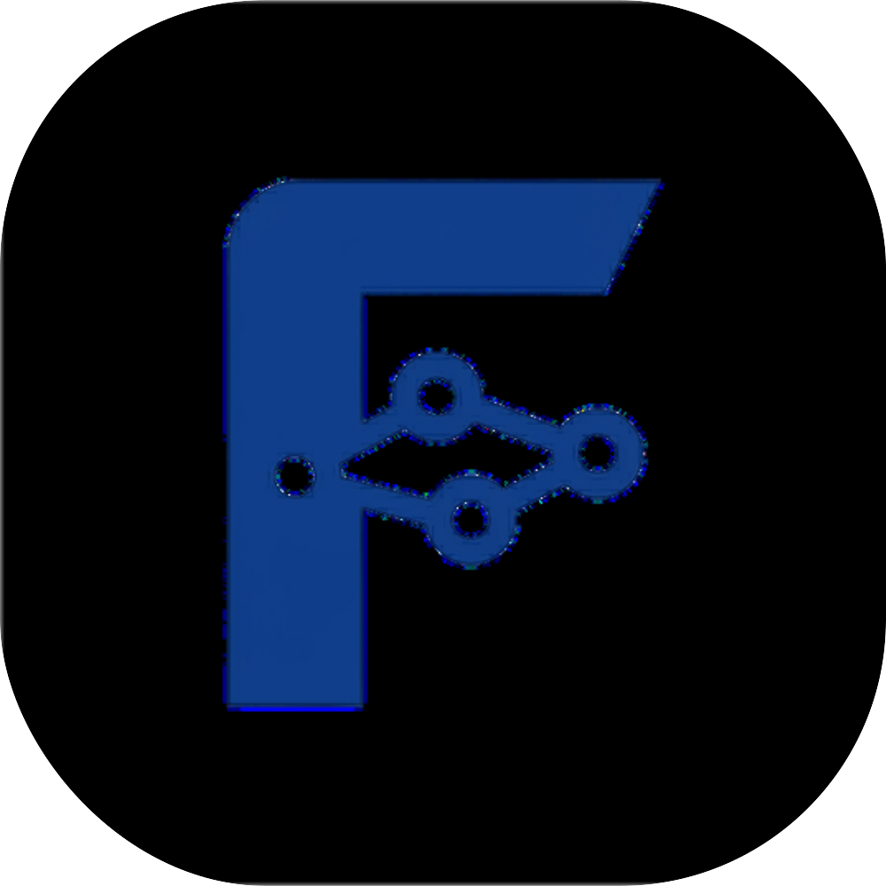

<!-- prettier-ignore -->
<div align="center">
  
  
  # FATAH | Gateway
  *A high-performance, minimalist personal link portal powered by React, Vite, and GSAP.*
  
  [](https://g.fatahmr.my.id/)
  [](https://react.dev/)
  [](https://vitejs.dev/)
  [](https://greensock.com/gsap/)

  ⭐ If you like this project, star it on GitHub!

  [Features](#features) • [Tech Stack](#tech-stack) • [Getting Started](#getting-started) 

</div>

This repository contains the source code for the personal link portal (Gateway) of Fatahilah Miftahul Rahman. Designed as a modern, high-speed alternative to Linktree, this gateway serves as a central hub to route visitors to my portfolio, blog, GitHub, LinkedIn, and direct contact channels.

**🌐 Live Website:** [https://g.fatahmr.my.id](https://g.fatahmr.my.id)

> [!TIP]
> The UI is heavily optimized for mobile devices, moving away from heavy `backdrop-filter` GPU usage to a "Solid Translucency" design, ensuring a consistent 60 FPS scrolling experience.

## Features

- ⚡ **High Performance** - Optimized with WebP assets and resource preloading for near-instant Largest Contentful Paint (LCP) scores.
- 🎬 **Cinematic Animations** - Smooth entrance animations and a custom page preloader powered by GSAP.
- 🌐 **Bilingual Support** - Instant language switching (ID/EN) managed dynamically via React Context.
- ⚙️ **Easy Configuration** - All personal data, links, and translations are centralized in a single `src/data/config.js` file, making it easy to use as a template.
- 🎨 **Minimalist UI** - Sleek dark/light modes and tailored color palettes.
- 📱 **Mobile-First UX** - Mobile sticky-hover states eliminated using pointer-device CSS media queries for a flawless touch experience.
- 📦 **PWA Ready** - Fully configured Web App Manifest and custom favicons for mobile installation.

## Tech Stack

- **Framework:** React + Vite
- **Styling:** Vanilla CSS (CSS Variables, Flexbox, Media Queries)
- **Animation:** GSAP (GreenSock Animation Platform)
- **Icons:** Lucide React

## Getting Started

To run this project locally, make sure you have Node.js installed.

1. Clone the repository:
   ```bash
   git clone https://github.com/fatahilah-mr/gateway.git
   ```
2. Navigate to the project directory:
   ```bash
   cd gateway
   ```
3. Install dependencies:
   ```bash
   npm install
   ```
4. Start the development server:
   ```bash
   npm run dev
   ```

## Author

**Fatahilah Miftahul Rahman**  
*Network Administrator & AI Prompt Specialist*  
- [Portfolio](https://fatahmr.my.id)
- [LinkedIn](https://linkedin.com/in/fatahilah-mr)
- [GitHub](https://github.com/fatahilah-mr)
